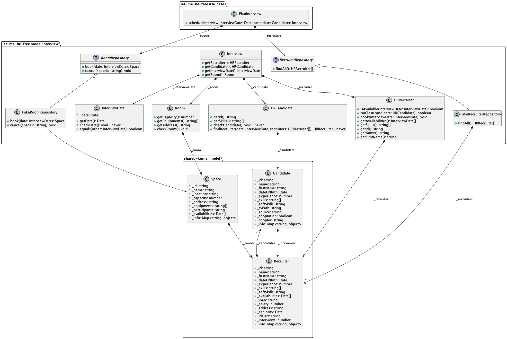
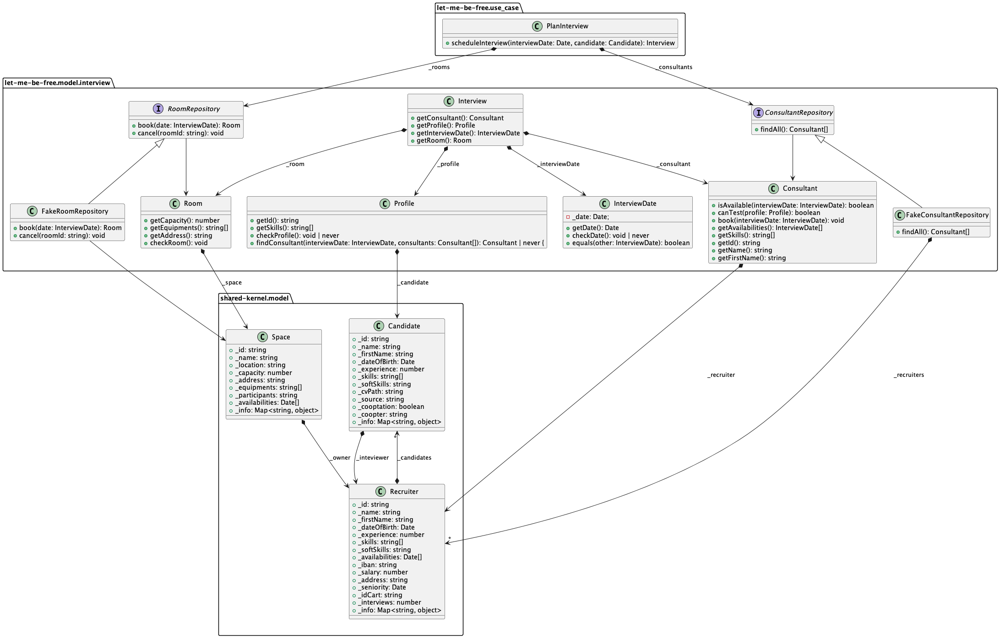

# Strategic Design Patterns   in DDD

Workshop to practice context mapping patterns   used in the strategic design of Domain-Driven Design.

 

**Jan Wloka**
[jan.wloka@quatico.com](jan.wloka@quatico.com)

## **Credits**: All content is based on the workshop of [Sepehr Namdar and Khaled Souf](https://github.com/ksouf/dddeu22-let-me-be-free-typescript) "Let Me be free"

---

> ## Domain
>
> Subject to which the user applies a program.

> ## Model
>
> A system of abstractions that describes selected aspects of a domain.

---

## Domain Models

* Consistent terms, free of contradictions
* Become larger and more confusing over time

> Each model should have a clearly defined boundary and the relationships between models should be explicitly named   —> **Context Mapping**.

---

## Context Maps

* Describe the contact between **Bounded Contexts** and teams
* Can be a chart, or any written document.
* Level of detail may vary
* Everyone on the project shares and understands it
* Helps the developers to take strategic decisions
* Utilize a collection of patterns

---

## Bounded Contexts

> A **Context** is the area in which a word or a
> statement appears that determines its meaning.

> A **Bounded Context** is a description of a
> boundary (typically a subsystem or the work of
> a particular team) within which a particular
> model is defined  and applicable.

---

## An HR System

The business application helps HR to manage interviews. Interviews are scheduled for candidates. For every scheduled interview HR needs to find a matching recruiter and to book an available room.

> ### Key use case
>
> As a Human Resource
> I want to find an available Recruiter According to my Candidate Availabilities *“Who can test”* my Candidate.

---

## Key Requirements

1. Application should find a Consultant who is available for the Interview Date
2. Consultant should be more experienced than the Profile for which we need to schedule an interview
3. Consultant should cover all skills mentioned in the Profile
4. If many Consultants can test, the System will choose the first one
5. Application should also find an available Room for the Interview Date

---

## HR System: Ubiquitous Language

* **Consultant**: A technical member of the company that should match the Profile of a Candidate
* **Profile**: Resume of the Candidate
* **Interview Date**: The day where Consultant & Candidate meet each other to do the evaluation
* **Candidate**: Someone who applied to passe the interview process
* **Interview**: A structured conversation where one participant asks questions, and the other provides answers
* **Room**: A place where the Interview will take place
* **Human Resource**: A member of HR department who will be in charged to organize the Interview

---

## HR System: Context Map

---

## Let's look at the code (Step-0)

---

## Pattern “Shared Kernel”

Overlap connected contexts through a “Shared Kernel”

---

## Shared Kernel: Practices

* Should be avoided if possible
* Requires:
  * Intensive communication between the teams
  * Experienced teams and appropriate awareness
  * A solid integration test suite
* One team should take responsibility
* Mainly found in Legacy-/BBOM-systems

---

## Pattern “Customer/Supplier”

Connect related contexts via "customer/supplier"

---

## Customer/Supplier: Practices

* Results of upstream team are used by downstream team
* Often used when Shared Kernel, conceptually incorrect or code sharing is not possible
* Good if both teams have the same leadership (easier decision-making)
* Regular customer meetings (customer presents requirements, supplier possible plans)

---

## Getting Started: With the code

* Clone this project
`git clone git@github.com:quatico-solutions/dddeu22-let-me-be-free-typescript.git`
* Build the project:
  * `yarn install`
  * `yarn dist` —> pass w/ successful tests
* Start development: `yarn watch:test`

---

## Exercise: Step 1

Get the code: `git checkout step-1`

* Our application is polluted by `shared-kernel` data.
* Shared Kernel is **Upstream** and used by other **Downstream**
systems (like HR System)
* We cannot modify it, thus it's not possible to add behavior to in these shared objects

1. **TODO:** Find a way to decouple the HR System from the Shared Kernel.

---

## Pattern “Anti-Corruption Layer (ACL)"

Two-way translator between two domains and languages: Communicates with the external model using the external language, not the client's.

---

## Anti-Corruption Layer: Practices

* Avoids that a context is "corrupted" by other contexts
* Always on the downstream side
* Filters data
* Useful when working with
  * Legacy systems (Bubble Context)
  * Large amount of data (ACL Backend Repository)

---

## Solution: Step 1

When you go to a cash desk, and you should pay 10$ what do you do?
Do you give your wallet to the cashier and ask him to find 10$ in it?

The idea of an **Anti-Corruption Layer (ACL)** is the same. It's about giving to the **Domain** just what it needs. We partially achieve this goal by creating new objects in our **Domain model**.

**Show your results!**

---

## Let's look at the code (Step-1)

---

## Exercise: Step 2 - Respect the UL

Get the code: `git checkout step-2`

An ACL has also the responsibility to translate data. An ACL can do more. As you may have noticed the terms used in the **Shared Kernel** system do not match our **Ubiquitous Language (UL)**.

TODOs:

1. Use our new objects and force them to respect our UL.
2. Review our UL and translate our code to complete the ACL.

---

## HR System: Ubiquitous Language (Reminder)

* **Consultant**: A technical member of the company that should match the Profile of a Candidate
* **Profile**: Resume of the Candidate
* **Interview Date**: The day where Consultant & Candidate meet each other to do the evaluation
* **Candidate**: Someone who applied to passe the interview process
* **Interview**: A structured conversation where one participant asks questions, and the other provides answers
* **Room**: A place where the Interview will take place
* **Human Resource**: A member of HR department who will be in charged to organize the Interview

---

## Let's look at the code (Step-2)

---

## Solution: Step 2

We’ve learned where to use an ACL, and we found a way to implement it. An ACL is one of the most useful **Context Mapping** strategies, if not the most important one.

There are other strategies to discover...

**Show your results!**

---

## Pattern “Open Host Service” (OHS)

Multiple (downstream) clients that implement the same services.

---

## Open Host Service: Practices

* Always used on the upstream side
* Adapt exposed services to coordinate with downstream contexts
* Useful when many downstream contexts depend on one upstream context
* Introduce a “Published Language” to satisfy all downstream contexts

---

## Exercise: Step 3

Get the code: `git checkout step-3`

Sometimes we can find a service which is duplicated in many systems.
It contains the same rules in every one of them. For example, if your are informed that all checks found in the HR System are also implemented in some other systems by other development teams.

TODOs:

1. Try to extract these services out of the application and put them in an **Open Host Service (OHS)**.

---

## Let's look at the code (Step-3)

---

## Solution: Step 3

We’ve learned how we can create an **Open-Host Service (OHS)** in an Upstream system.

We’ve also talked about the **Published Language**, and we recognized how it can impact our system.

**Show your results!**

---

## Next Step: What to do with Room Booking?

---

## Pattern “Conformist”

Overlap two contexts one-sided with "Conformist"

---

## Conformist: Practices

* Always used on downstream site
* Downstream context has no way to negotiate with upstream context
* Like an Anti-corruption layer, but willing to conform
* Downstream integrates with upstream context's constructs

---

## Pattern “Separate Ways”

If you cannot collaborate at all, go separate ways.

---

## Separate Ways: Practices

* Communication and integration costs between contexts are too high
* Two teams that cannot support each other
* Two teams with too big a time difference
* We accept duplication

---

## Exercise: Step 4

Get the code: `git checkout step-4`

Given hypothesis, suggest one or more integration solutions to communicate between "Interview Planning" and "Room Booking".

Let's take a look at the method `checkRoom()` in class `Room`.

TODOs:

1. What strategy do you propose to resolve the problems mentioned?
2. Discuss them and share a possible solution.

---

## Final Words

The Domain evolves, and Context Mapping Strategies can help to change the system along the way.

*"if the architecture of the organization is at odds with the architecture of the system, the architecture of the organization wins."* — Ruth Malan, Architect

---

